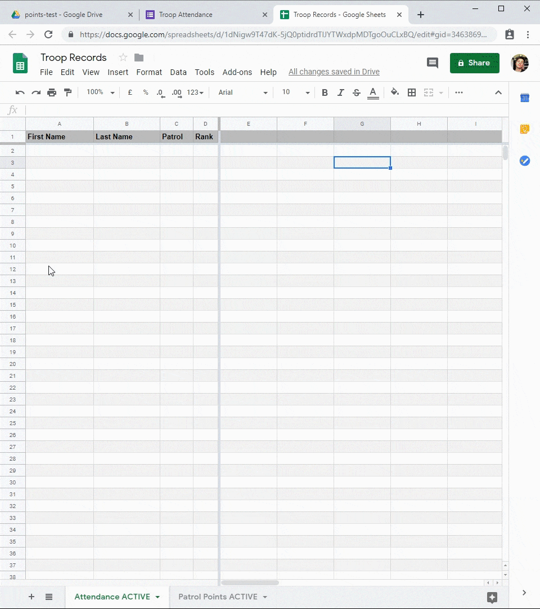

# Scout Grading

Designed to minimise the administration that accompanies running a scout troop. This includes attendance logging, automatically generated patrol grading forms & a smart patrol point calculater. Displays data in an easy to read format.

Utilises Google [forms](https://forms.google.com) & [sheets](https://sheets.google.com) to allow for simple, UI based modification and customisation.

Written in Google Apps Script, a JavaScript platform in the cloud.

Learn more: https://developers.google.com/apps-script

### Functionality

* Collect attendance data
* Assess uniform & other gradeable factors
* Calculate and award points
* Display results in an easy to read format

## Workflow

  

## Demo

All data is read from the master form as entered below. Upon submission, the necessary data ecosystem is generated by `form-manager.gs`—handling additions, removals & edits to the register.

These operations execute concurrently upon submission of the master form:
* Attendance is logged to the associated spreadsheet.
  - If necessary, a row is created for the member.
* Contents of the patrol specific form is generated to reflect the most recent register & the member's attendance.

  
   

Following weeks of usage the linked spreadsheet will populate as follows.

  
   

## Usage

Designed to be quick and easy to use. With all additions, edits and removal of members/patrols done via a graphical interface.

#### Creating Patrols
A patrol is defined by a `Title and description` item:
- The patrol name is set per the headers' title.
- The description can be left blank.
- Create more patrols by adding additional `Title and description` items:
  - Ensure each `Title and description` is followed by a `Multiple choice grid`.

#### Defining Members
The subsequent `Multiple choice grid` is interpreted as the patrol itself:

- Leave the title blank.
- Each row defines a patrol member:
  - The patrol member's name is set by the row's name
  - To attach a rank to a patrol member, preface their name with:
    - `PL`  — Patrol Leader
    - `APL` — Assistant Patrol Leader
 - Columns should be set to:
   - `Present`
   - `Absent`
   - `Notified Absence` (optional)

#### Screenshots

<table width="100%">
  <tr>
    <td>  </td>
    <td>  </td>
  </tr>
   <tr>
    <td> <i>Select "Add title and description" and choose a name</i> </td>
    <td> <i>The subsequent item should be a "Multiple choice grid"</i> </td>
  </tr>
  <tr>
    <td>  </td>
    <td>  </td>
  </tr>
  <tr>
    <td> <i>Ensure "Present" & "Absent" are included as columns</i> </td>
    <td> <i>The form should appear like this</i> </td>
  </tr>
</table>

## Installation

1. Make a copy of each the files within the [scouts-grading G Drive directory](https://drive.google.com/open?id=1MN9GEt42tenHOS_lwxHhdEU6lPMXRF7d).
    - G Drive is able to "Make a copy" of all files in one operation if all 3 files are selected.
2. Place the new files in a folder of their own to avoid clutter. (optional)
    - When run, `form-manager.gs` will generate additional forms which are placed in the same folder as the form defined by `masterFormId`. (see below)
3. Open `Copy of scouts-grading` and navigate to *File > Project properties > Script properties*.
    - Feel free to rename the file.
4. Select *+ Add row* twice and define both `writeSheetId` and `masterFormId`.
5. Copy the id from `Copy of Troop Records` and `Copy of Troop Register` and set the value of the properties respectively.
    - The id of a document is the 44 char. hash in the document's URL.
        - id in **bold**: docs&#46;google&#46;com/spreadsheets/d/**1HF3J1_hjian3oiD2nl1YvB6eLxw8kj1wYigKhzROZP8**/edit
6. Open `setup.gs` from the list on the left and navigate to *Run > Run function > triggerSetUp*
7. Verify the app and grant requested permissions.

The spreadsheet defined by `writeSheetId` will be populated upon the first submission of the form defined by `masterFormId`.

## Clone using the `clasp` command line tool

Learn how to clone, pull, and push Apps Script projects on the command line
using [clasp](https://developers.google.com/apps-script/guides/clasp).

## License

The code is available under the [MIT license](LICENSE.md).
