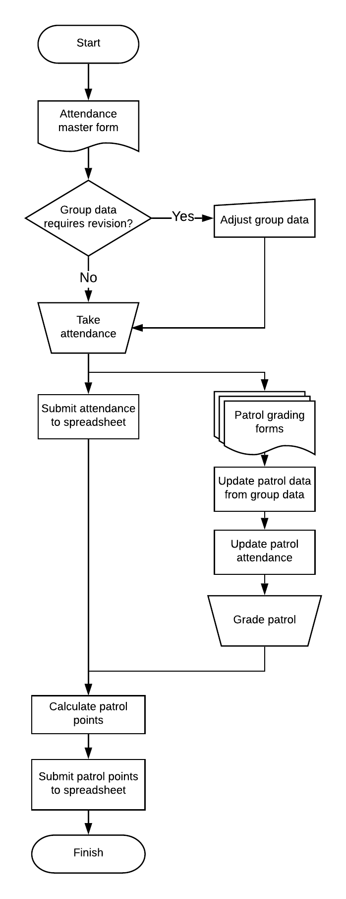

# Scout Grading

Designed to minimise the administration that accompanies running a scout troop.

Utilises Google [forms](https://forms.google.com) & [sheets](https://sheets.google.com) to allow for simple, UI based modification and customisation.

Written in Google Apps Script, a JavaScript platform in the cloud.

Learn more: https://developers.google.com/apps-script


<p>
  
   
</p>

### Functionality

* Collect attendance data
* Assess uniform & other gradeable factors
* Calculate and award points
* Display results in an easy to read format

### Workflow

<p align="left">
  
</p>


## Google APIs


### AdminSDK
- [Manage domains and apps](adminSDK)
<br><br>


### Advanced Services
- [Access Google APIs via Advanced Google services](advanced/)
<br><br>


## Codelabs

Codelab tutorials combine detailed explanation, coding exercises, and documented best practices to help engineers get up to speed with key Google technologies. Here's a list of Apps Script codelabs:

- [Apps Script Intro](http://g.co/codelabs/apps-script-intro)
- [Apps Script CLI – clasp](http://g.co/codelabs/clasp)
- [BigQuery + Sheets + Slides](http://g.co/codelabs/bigquery-sheets-slides)
- [Docs Add-on + Cloud Natural Language API](http://g.co/codelabs/nlp-docs)
- [Gmail Add-ons](http://g.co/codelabs/gmail-add-ons)
- [Hangouts Chat Bots](http://g.co/codelabs/chat-apps-script)

## Clone using the `clasp` command line tool

Learn how to clone, pull, and push Apps Script projects on the command line
using [clasp](https://developers.google.com/apps-script/guides/clasp).

## Lint

Run ESLint over this whole repo with:

```
npm run lint
```

This command will fix simple errors.
